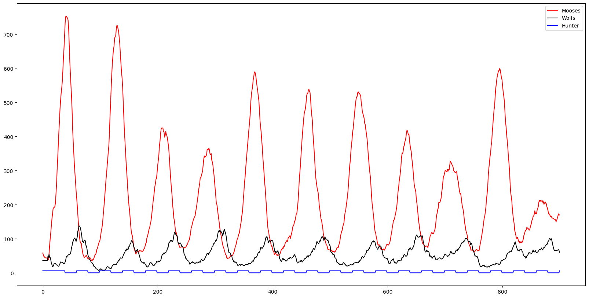

# Agent-Based-Predator-Prey-System-for-3-Species
## Project done for the course Simulation of complex systems - FFR120
The repository consists of three programs AgentSystem and ParameterSearchGA.

### Requirements
Python3
Numpy
Matplotlib
IPython

## Graphs 

